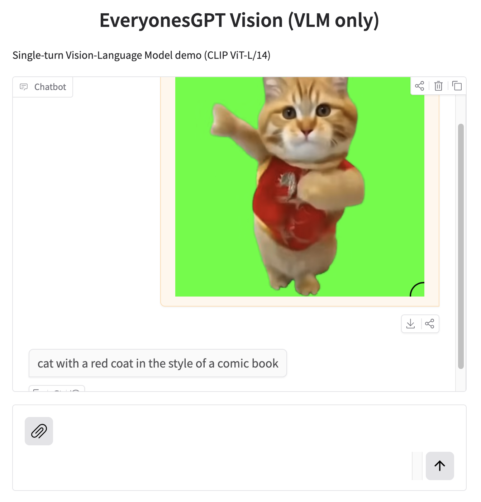

# nanoGPT-Vision

> ChatGPT4o–like Vision AI that $100 can buy.

## [Link to WebUI](https://huggingface.co/spaces/HayatoHongoEveryonesAI/EveryonesGPT_Vision_Pretrained)

⚠️ **Status: actively being cleaned up and documented.**
The core ideas and training runs are real and reproducible,  
but parts of the codebase and README are still under active refinement.

---

`nanoGPTVision` is a **minimal Vision-Language Model built end-to-end**,  
featuring a **GPT-style text decoder trained fully from scratch**.

The project is heavily inspired by **Andrej Karpathy’s nanoGPT** and follows the same philosophy:
> understand the system by building it yourself.

A pretrained **CLIP vision encoder** is used for visual representations (Sorry😉),  
while **all language modeling and vision–language training code is written, data is public, and trained from scratch**.

---

## Why this project exists

Most open VLMs reuse large pretrained language models (LLaMA, Vicuna, etc.).

**nanoGPTVision does not.**

Instead, it focuses on:
- training the **text decoder from scratch**
- keeping the architecture minimal and readable
- making the design choices explicit
- showing how far you can go on a small, transparent budget

Alghough the CLIP encoder is external, to the best of our knowledge, 
this is the first publicly released publicly to build vision language model from scratch,
LLM and vision projector.

---

## Project philosophy

This is **not a polished product**.

This is a **work-in-progress research and learning project**.

---

## Training setup & cost breakdown

All numbers below are **actual runs**, not estimates.

# How to build your own Vision Language Model

### 1. Language Pretraining

- Model: GPT-style language model
- Hardware: **Lambda Cloud A100 × 8**
- Time: **~6 hours**
- Cost: **~$90**

## WebUI

Please clone this huggingface space and replace the model checkpoint with your one.

https://huggingface.co/spaces/HayatoHongoEveryonesAI/EveryonesGPT_Pretrained

---

### 2. Language SFT
- Vision encoder: **OpenAI CLIP**
- Hardware: **Google Colab Pro – A100 (high memory)**
- Time: **~5 hours**
- Cost: **~$4**

Available on Colab!

https://colab.research.google.com/drive/1CvgpTAJzpsZjraCSxJ8phYyAmSMw-LwJ?usp=sharing

## WebUI

Please clone this huggingface space and replace the model with your one.

https://huggingface.co/spaces/HayatoHongoEveryonesAI/EveryonesGPT_SFT

---

### 3. Vision pretraining (for the SFT model)
- Hardware: **Google Colab Pro – A100 (high memory)**
- Time: **~3 hours**
- Cost: **~$2**

Available on Colab!

https://colab.research.google.com/drive/1QR8ygk2RsGuDt9w8Nmz0Zn8aC6MBYoD6?usp=sharing

#### Inference

Available on Colab!

https://colab.research.google.com/drive/1GK9y0BAt2Xdyploc5B55kyNlxyZuwckQ?usp=sharing

#### Web UI

Please clone this huggingface space and replace the model checkpoint with your one.

https://huggingface.co/spaces/HayatoHongoEveryonesAI/EveryonesGPT_Vision_Pretrained

### 4.  Vision Instruction Tuning (for the Vision Pretrained model)

Still under construction! please wait! we will release in January!

---

### 💰 Total cost
**≈ $96 USD**

---

## Current status

- [x] From-scratch text decoder
- [x] CLIP-based vision encoder
- [x] Vision-language pretraining
- [ ] Expanded Vision instruction tuning (WIP)
- [ ] Code cleanup & documentation (in progress)
- [ ] Build Clip from scratch

## Acknowledgements

- Andrej Karpathy — nanoGPT, nanoChat(for streaming) and its philosophy
- OpenAI — CLIP
- Haotian Liu - LLaVA
- Sebastian Raschka - LLM SFT 

This repository is provided for research and educational purposes.
Expect rough edges, missing pieces, and ongoing refactors.
